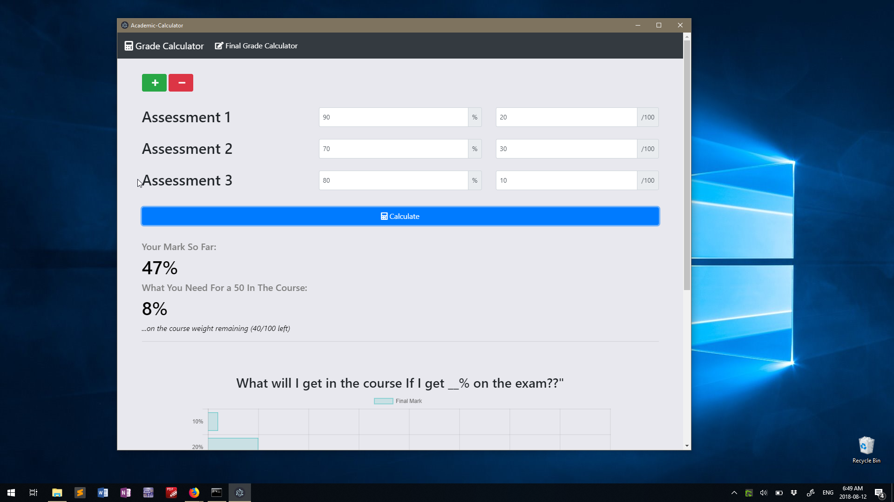
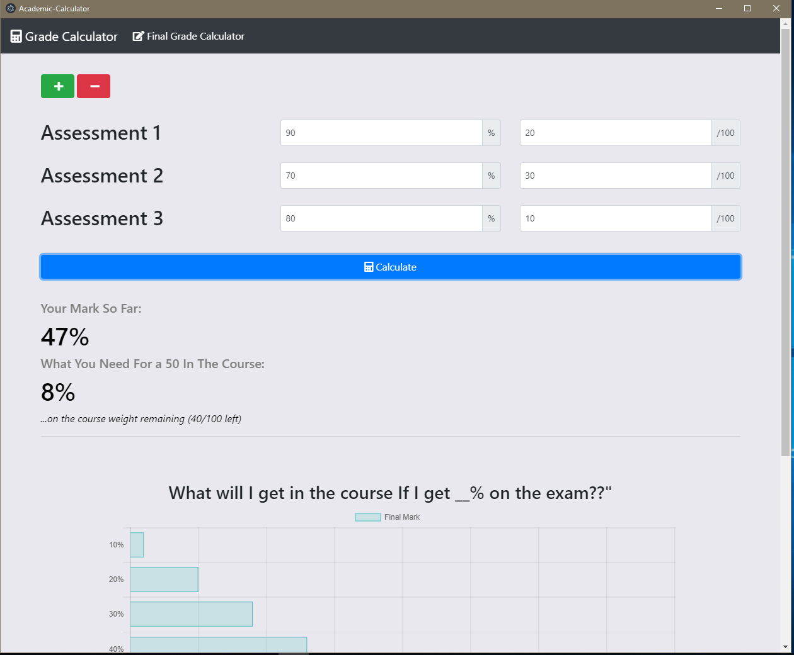

# Academic Calculator

Desktop version of my calculator app (https://jeffreyhui.com/grades) to download and use without accessing the site. 



The web app is built with AngularJS and Chartjs and Electron was used to port it over to desktop. 

## Additional Screenshots




## How to Use

### Windows Installer
Clone the repo and run the installer (Academic-CalculatorInstaller.exe) inside ````windows-installer```` folder

### npm and Electron
If you have npm and electron installed, you can simply clone the repo, then run ````npm install```` followed by ````npm start```` insde the repo. 

## Disclaimer
Building this was a learning tool for electron and Angular so it's probably still rough around the edges. If you find any bugs, please raise an issue. 

