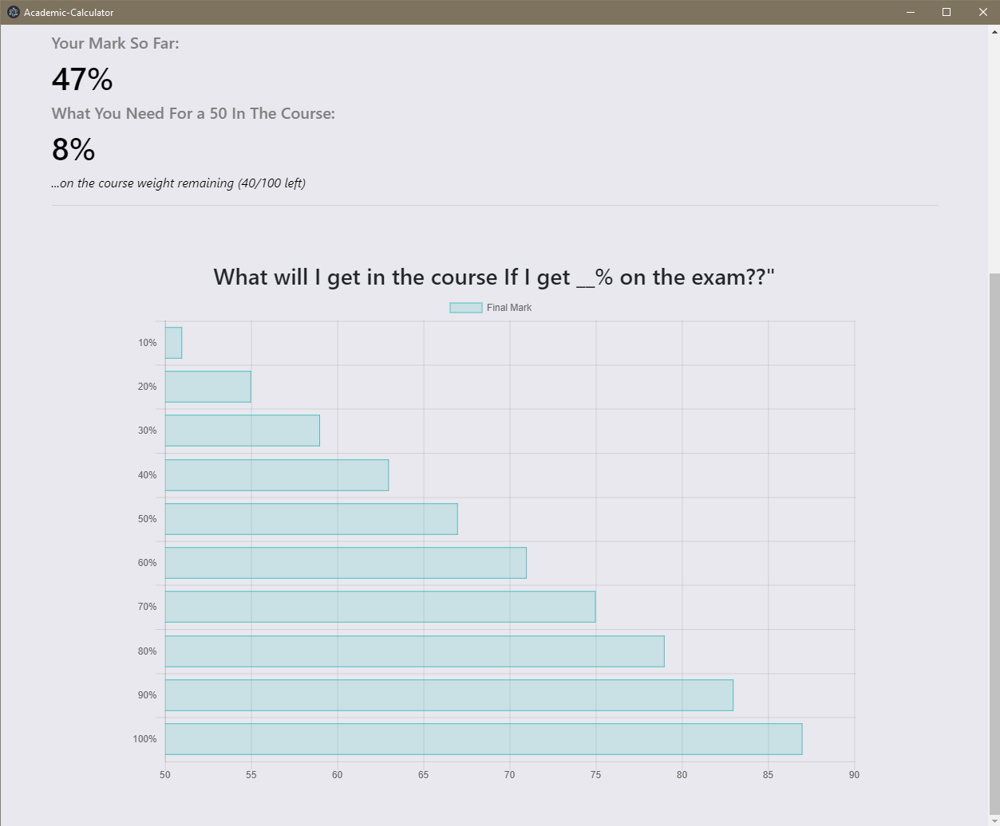

# Academic Calculator

Desktop version of my calculator app (https://jeffreyhui.com/grades) to download and use without accessing the site. 


The web app is built with AngularJS and Chartjs and Electron was used to port it over to desktop. 

## Usage

Simply add your grades to calculate your current standing in your course and find out what you need to get an A! The calculator shows your final mark based on several grade scenarios for the percentage remaining and displays a chart of all the possible marks.

## Additional Screenshots



## How to Use

### Windows Installer
Clone the repo and run the installer (Academic-CalculatorInstaller.exe) inside ````windows-installer```` folder

### npm and Electron
If you have npm and electron installed, you can simply clone the repo, then run ````npm install```` followed by ````npm start```` insde the repo. 

## Disclaimer
Building this was a learning tool for electron and Angular so it's probably still rough around the edges. If you find any bugs, please raise an issue. 


## Reviews
  - "This is the greatest app I ever used! I passed my courses because of it" - **Rahul Software Engineering at Facebook**
